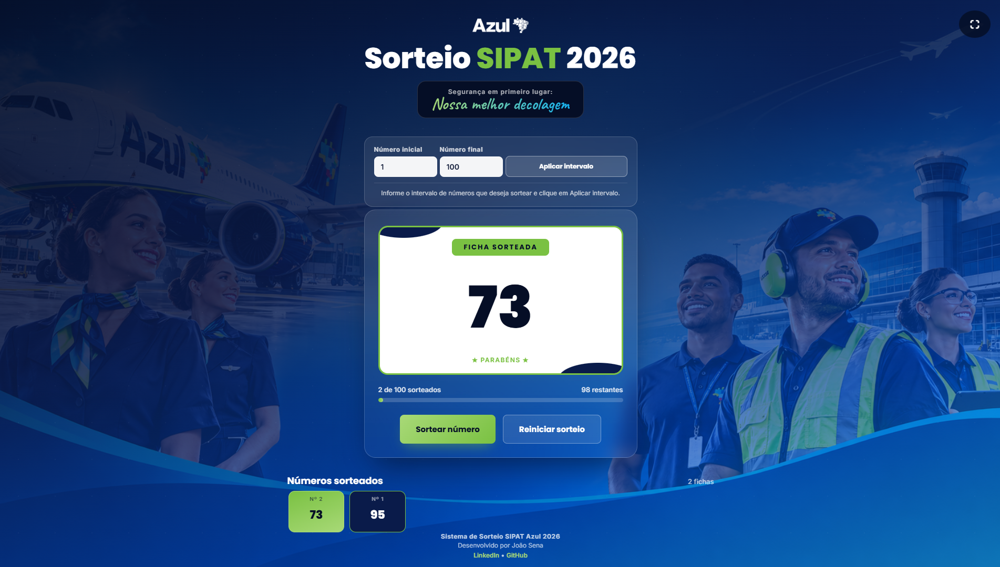

# SIPAT2026

Sistema de sorteio desenvolvido para a SIPAT 2026 da Azul Linhas Aéreas, com animações, interface responsiva e controle de participantes.

## 📸 Demonstração

## ✨ Funcionalidades

- Sorteio automatizado de participantes
- Animação estilo roleta
- Histórico de números sorteados
- Modo tela cheia
- Interface responsiva
- Confirmação de reinicialização via modal

## 🛠️ Tecnologias Utilizadas

- HTML5
- CSS3
- JavaScript

## 🚀 Acesso

Acesse o projeto: https://joaosena-js.github.io/SIPAT2026/

## 👨‍💻 Autor

João Sena

- LinkedIn: https://www.linkedin.com/in/joaosenajs/
- GitHub: https://github.com/joaosena-js
